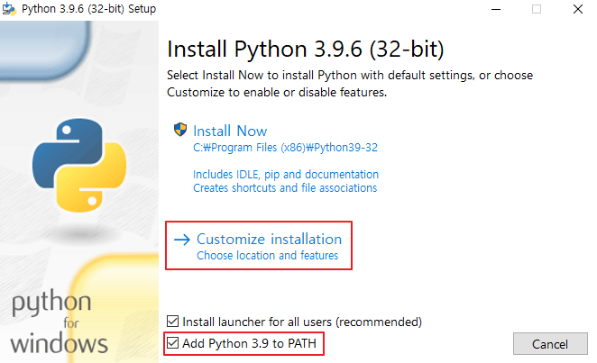
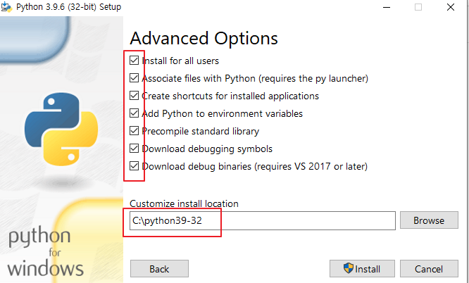
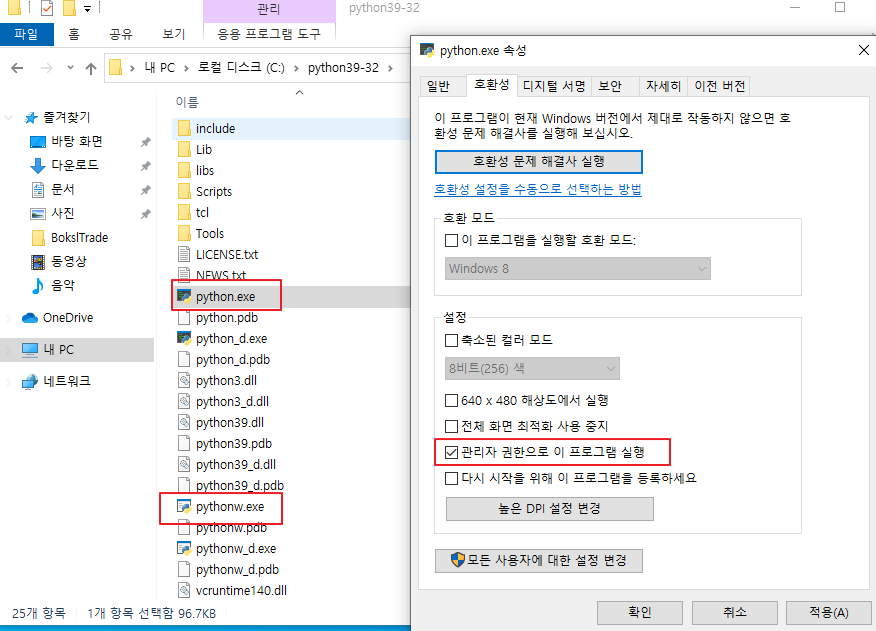
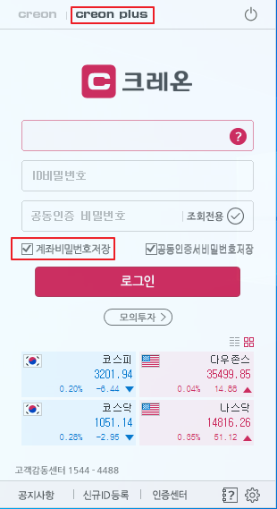
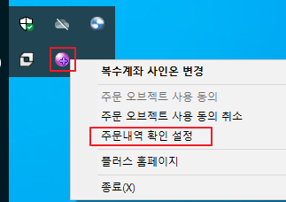
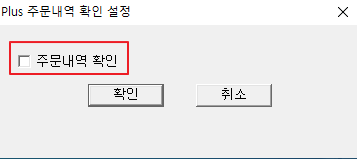
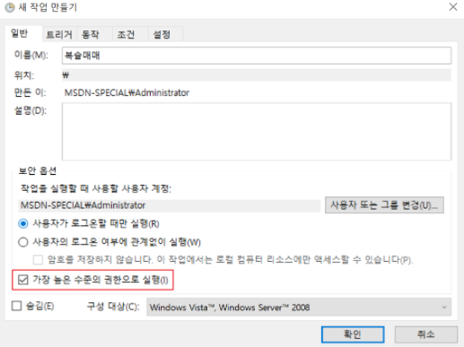

# 1. 복슬매매

---

**경고: 본 소스코드는 누구나 사용할 수 있으며 그로 인해 발생하는 모든 문제의 책임은 사용자에게 있습니다.**

---


주식 자동 매매 프로그램입니다. 대신증권 `크래온 PLUS` API 활용해 시세 데이터를 클로링 합니다.
크롤링한 데이터를 이용해 이동평균선 돌파 전략으로 매매를 수행합니다.

## 1.1. 자동매매

### 1.1.1. 매매 전략
`변동성 돌파` 전략을 사용하여 매매
- 매수 조건: 현재 가격이 목표가를 돌파하면 매수
  - 목표가 = 오늘 시초가 + (전일 고가 - 전일 저가) * 변동폭(k)
- 매도 조건: 매수 다음날 시가 매도
### 1.1.2. 관련 소스 파일
- [boksl_trade/vbs_trade.py](boksl_trade/vbs_trade.py) 변동성 돌파 전략을 사용한 매매 메인 소스
- [boksl_trade/hts.py](boksl_trade/hts.py) 크래온 PLUS 재시작
- [boksl_trade/config.py](boksl_trade/config.py) 슬랙, 로깅, 변동성 돌파 변수 설정
- [boksl_trade/log.py](boksl_trade/log.py) 로그 관련 설정(파일, 출력 패턴 등)

### 1.1.3. 사전 준비사항
- 크래온 계좌 개설
- [시스템 트레이딩](https://www.creontrade.com/g.ds?m=1965&p=577&v=4151) 신청 (크레온 홈 -> 온라인지점 -> 서비스신청 -> 시스템트레이딩)
### 1.1.4. 관련 프로그램 실행

1. 프로그램 설치
   - [CREON HTS](https://money2.creontrade.com/E5/WTS/Customer/GuideTrading/CW_DownloadCenter.aspx?m=2194&p=3234&v=2406) 설치
   - [파이썬 32bit](https://www.python.org/downloads/release/python-396/) 반드시 **32bit** 설치
     - 인스톨 과정에서 `Add Python 3.9 PATH` 체크
       - 
     - 모든 옵션 체크 후 디렉토리 경로 지정
       - 
     - 인스톨 후 `python.exe`, `pythonw.exe` 관리자 권한으로 프로그램 실행 설정
       - 
2. `크레온 PLUS`설정
   - 로그인 (`creon plus` 선택)
     - `계좌비밀번호저장` 항목 체크
     - 
     - 시스템 트레이에서 `주문내역 확인` 체크 해제
       - 
       - 
3. 패키지 설치
     ```sh
     pip install pywin32
     pip install pandas
     pip install requests
     pip install pywinauto
     pip install cryptography
     pip install tendo
     ```
4. 설정 값 입력
  - [boksl_trade/hts.py](boksl_trade/hts.py) 아이디, 비밀번호, 공동인증서 비밀번호 입력
  - [boksl_trade/config.py](boksl_trade/config.py) 설정 입력
5. 실행
  - `관리자 권한`으로 명령 프롬프트 실행
    ```sh
    python hts.py
    python vbs_trade.py
    ```
  - 명령어 실행 이후 자동매매 진행
  - `작업 스케줄러`를 이용해 매일 hts.py, vbs_trade.py가 실행되도록 작업 추가
    - 작업등록 시 보안옵선 항목 `가장 높은 수준의 권한으로 실행` 체크
      - 
    - hts.py -> 매일 08:30분에 실행
    - vbs_trade.py -> 매일 오전 08:45분에 실행

### 1.1.5. AWS 셋팅
[EC2에서 Windows 7/8/10 설치하기](https://tech.yangs.kr/3) 문서 참고 셋팅 바람

- [AWS 관련 설정](aws)
- 사용한 명령어
  ```sh
  aws configure
  aws sts get-caller-identity

  aws s3 cp win10_1.vhd s3://windows-trade/win10_1.vhd

  aws iam create-role --role-name vmimport --assume-role-policy-document file://policy.json
  aws iam put-role-policy --role-name vmimport --policy-name vmimport --policy-document file://policy-import.json
  aws ec2 import-image --license-type BYOL --disk-containers file://win10-image.json
  aws ec2 describe-import-image-tasks --import-task-ids import-ami-0f7f50d55e2afefaa
  ```
## 1.2. 백테스트
### 1.2.1. 파일 설명
- [boksl_trade/backtest/crawling.py](boksl_trade/backtest/crawling.py) 1분봉 데이터 크롤링 - 최근 2년치 데이터만 크레온 PLUS에서 제공합니다.
- 백테스트
  - [boksl_trade/backtest/backtest_single.py](boksl_trade/backtest/backtest_single.py) 하나의 조건 테스트. 일일 매도/매수 내역이 엑셀파일 출력
  - [boksl_trade/backtest/backtest_multi.py](boksl_trade/backtest/backtest_multi.py) 여러 조건별로 요약결과가 제공. 조건별 투자 수익률, MDD 결과가 엑셀파일로 출력
- [boksl_trade/backtest/backtest_module.py](boksl_trade/backtest/backtest_module.py) 변동성 돌파 전략 알고리즘

### 1.2.2. 백테스트 조건
- 변동성 돌파 판단 비율
- 대상종목
- 총 현금을 기준으로 투자 비율. 1은 전액, 0.5은 50% 투자
- 분석대상 기간 - 시작
- 분석대상 기간 - 종료
- 최초 투자금액
- 매매시 채결 가격 차이
- 매수 수수료
- 매도 수수료
- 상승 매수률
- 하락 매도률
- 단기 이동평균 기간
- 장기 이동평균 기간
- 조건에대한 설명 글

※ 관련 소스코드 `condition.py` 참고

### 1.2.3. 매매 조건
#### 1.2.3.1. 매수 조건
아래 조건을 모두 만족해야 매수가 됨

- 직전 영업일 기준 매수 돌파가 없어야 함
- 단기 이동평균값 - 단기 이동평균값 * 상승 매수률 >= 장기 이동평균

예시)
- 단기 이동평균값: 10,000
- 장기 이동편균값: 9,800
- 상승 매수률: 0.01

  ```
  10,000 - 10,000 * 0.01 >= 9,800
  = 9,900 >= 9,800
  => 매수
  ```
#### 1.2.3.2. 매도 조건
아래 조건을 모두 만족해야 매수가 됨

- 매수 상태여야함
- 단기 이동평균값 + 단기 이동평균값 * 하락 매도률 <= 장기 이동평균

예시)
- 단기 이동평균값: 9,700
- 장기 이동편균값: 10,000
- 상승 매수률: 0.02

  ```
  9,700 + 9,700 * 0.02 <= 10,000
  = 9,894 <= 10,000
  => 매도
  ```

### 1.2.4. 시세 클로링 데이터
#### 1.2.4.1. 1분봉 2019.6.25 ~ 2021.6.24
- `data/1_minute/A069500.csv`: KODEX 200
- `data/1_minute/A114800.csv`: KODEX 레버리지
- `data/1_minute/A122630.csv`: KODEX 인버스
- `data/1_minute/A252670.csv`: KODEX 200선물인버스2X
#### 1.2.4.2. 5분봉 2016.6.29 ~ 2021.6.28
- `data/5_minute/A069500.csv`: KODEX 200
- `data/5_minute/A114800.csv`: KODEX 레버리지
- `data/5_minute/A122630.csv`: KODEX 인버스
- `data/5_minute/A252670.csv`: KODEX 200선물인버스2X

## 1.3. 참고
- [크래온플러스 API](https://money2.creontrade.com/e5/mboard/ptype_basic/HTS_Plus_Helper/DW_Basic_List_Page.aspx?boardseq=284&m=9505&p=8841&v=8643)
- [파이썬 증권 데이터 분석](https://github.com/INVESTAR/StockAnalysisInPython)
- [조코딩](https://www.youtube.com/watch?v=Y01D2J_7894&list=PLU9-uwewPMe0fB60VIMuKFV7gPDXmyOzp&index=1&ab_channel=%EC%A1%B0%EC%BD%94%EB%94%A9JoCoding)